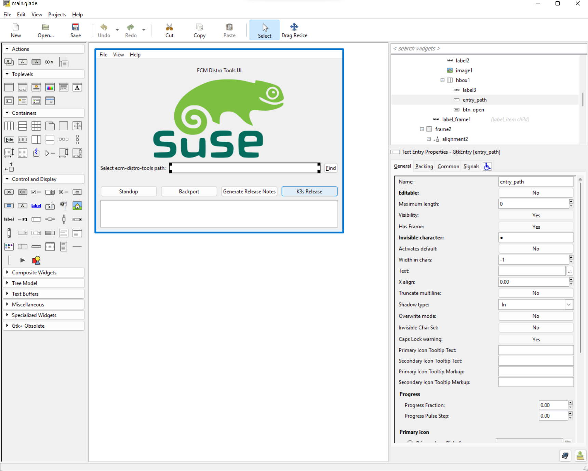

# ECM Distro Tools UI

## UI Development

1. Download glade from https://glade.gnome.org/
2. Open the main.glade file in the editor
3. Start designing!



## Instructions for Linux:

1. Follow the instructions on https://github.com/mattn/go-gtk to install the GTK2 development libraries.
2. Clone [ecm-distro-tools-ui repo](https://github.com/wgsuse/ecm-distro-tools-ui)
3. Run `go get ...`
4. Run `make`
5. Execute `bin/ecm-distro-tools-ui`

## Instructions for Windows:

### Steps to execute:

1. Download the GTK2 runtime from:
	https://github.com/tschoonj/GTK-for-Windows-Runtime-Environment-Installer
2. Run the binary `bin/ecm-distro-tools-ui.exe`

### Steps to build:

1. Clone [ecm-distro-tools-ui repo](https://github.com/wgsuse/ecm-distro-tools-ui)
2. Run `go get ...`
3. Install [msys2](https://www.msys2.org/)
4. Add the following to your PATH:
	- c:\msys64\mingw64\bin
	- c:\msys64\usr\bin
5. Install the build toolchain
```
	pacman -S mingw-w64-x86_64-gtk2 \
	        mingw-w64-x86_64-pango \
	        mingw-w64-x86_64-glib2 \
	        mingw-w64-x86_64-toolchain \
	        base-devel vim cmake
```		
6. Select all and install
7. Use any text editor and open the following files:
	- C:\msys64\mingw64\lib\pkgconfig\gdk-win32-2.0.pc
	- C:\msys64\mingw64\lib\pkgconfig\gdk-2.0.pc
8. Remove this text from the Libs section: " -Wl,-luuid"
9. Run `make`

### Note:

Make sure the GTK2 installation path is before mingw64 in the path order. 

(Run `sysdm.cpl` and edit the PATH order in the Advanced/Environment Variables section)
